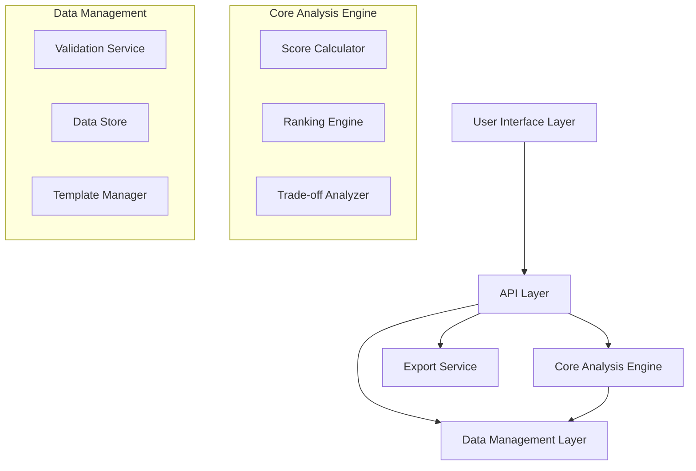

# Design Document: Decision Helper Tool

## Overview

The Decision Helper Tool is a web-based application that implements Multi-Criteria Decision Analysis (MCDA) principles to help users compare options and understand trade-offs systematically. The tool combines established decision-making methodologies with modern UX design patterns to create an intuitive comparison experience.

The system uses a weighted scoring approach similar to the Weighted Sum Model (WSM) and Simple Multi-Attribute Rating Technique (SMART), allowing users to define criteria, weight their importance, and evaluate options across multiple dimensions. The design emphasizes visual clarity, data validation, and actionable insights rather than just information presentation.

## Architecture

The system follows a modular architecture with clear separation between data management, analysis logic, and presentation layers:



**Key Architectural Decisions:**
- **Stateless API Design**: Each analysis request is self-contained, enabling easy scaling and testing
- **Pluggable Scoring Methods**: Core engine supports multiple MCDA algorithms (starting with WSM)
- **Template-Based Initialization**: Pre-built templates reduce setup friction for common scenarios
- **Client-Side Rendering**: Rich interactive comparisons require responsive UI updates

## Components and Interfaces

### 1. Option Manager
Handles the creation, validation, and management of comparison options.

**Interface:**
```typescript
interface Option {
  id: string;
  name: string;
  type: OptionType; // 'api' | 'cloud-service' | 'tech-stack' | 'tool' | 'custom'
  attributes: Record<string, AttributeValue>;
  metadata?: {
    url?: string;
    description?: string;
    tags?: string[];
  };
}

interface OptionManager {
  addOption(option: Omit<Option, 'id'>): Promise<Option>;
  updateOption(id: string, updates: Partial<Option>): Promise<Option>;
  removeOption(id: string): Promise<void>;
  validateOption(option: Option): ValidationResult;
}
```

### 2. Criteria Engine
Manages evaluation criteria and their weights, with built-in validation for common criteria types.

**Interface:**
```typescript
interface Criterion {
  id: string;
  name: string;
  type: CriterionType; // 'cost' | 'performance' | 'scalability' | 'ease-of-use' | 'custom'
  weight: number; // 0-100
  scale: ScaleType; // 'numeric' | 'ordinal' | 'boolean'
  scaleDefinition?: ScaleDefinition;
}

interface CriteriaEngine {
  addCriterion(criterion: Omit<Criterion, 'id'>): Promise<Criterion>;
  updateWeights(weights: Record<string, number>): Promise<void>;
  validateCriteria(criteria: Criterion[]): ValidationResult;
  normalizeWeights(weights: Record<string, number>): Record<string, number>;
}
```

### 3. Analysis Engine
Core component that performs MCDA calculations and generates trade-off insights.

**Interface:**
```typescript
interface AnalysisResult {
  scores: Record<string, number>; // optionId -> weighted score
  rankings: RankedOption[];
  tradeOffs: TradeOffAnalysis[];
  recommendations: Recommendation[];
  qualityScore: number; // 0-100, based on data completeness
}

interface AnalysisEngine {
  analyze(options: Option[], criteria: Criterion[]): Promise<AnalysisResult>;
  calculateScores(options: Option[], criteria: Criterion[]): ScoreMatrix;
  identifyTradeOffs(scoreMatrix: ScoreMatrix): TradeOffAnalysis[];
  generateRecommendations(analysis: AnalysisResult): Recommendation[];
}
```

### 4. Visualization Engine
Handles the rendering of comparison matrices, charts, and interactive elements.

**Interface:**
```typescript
interface ComparisonMatrix {
  options: Option[];
  criteria: Criterion[];
  scores: ScoreMatrix;
  visualConfig: MatrixVisualizationConfig;
}

interface VisualizationEngine {
  renderMatrix(matrix: ComparisonMatrix): MatrixComponent;
  renderTradeOffChart(tradeOffs: TradeOffAnalysis[]): ChartComponent;
  renderRecommendations(recommendations: Recommendation[]): RecommendationComponent;
}
```

### 5. Export Service
Generates professional reports and shareable formats.

**Interface:**
```typescript
interface ExportService {
  generatePDF(analysis: AnalysisResult, options: ExportOptions): Promise<Buffer>;
  generateMarkdown(analysis: AnalysisResult): string;
  generateJSON(analysis: AnalysisResult): ComparisonExport;
  createShareableLink(comparisonId: string): Promise<string>;
}
```

## Data Models

### Core Data Structures

```typescript
// Primary entities
interface ComparisonSession {
  id: string;
  name: string;
  description?: string;
  options: Option[];
  criteria: Criterion[];
  analysis?: AnalysisResult;
  createdAt: Date;
  updatedAt: Date;
}

// Scoring and analysis
interface ScoreMatrix {
  [optionId: string]: {
    [criterionId: string]: {
      rawValue: AttributeValue;
      normalizedScore: number; // 0-100
      weightedScore: number;
    };
  };
}

interface TradeOffAnalysis {
  criterionId: string;
  criterionName: string;
  winner: {
    optionId: string;
    optionName: string;
    score: number;
  };
  loser: {
    optionId: string;
    optionName: string;
    score: number;
  };
  gap: number; // percentage difference
  significance: 'high' | 'medium' | 'low';
}

interface Recommendation {
  optionId: string;
  optionName: string;
  rank: number;
  overallScore: number;
  strengths: string[];
  weaknesses: string[];
  bestFor: string[]; // scenarios where this option excels
  reasoning: string;
}

// Templates and presets
interface ComparisonTemplate {
  id: string;
  name: string;
  description: string;
  category: string; // 'api-comparison' | 'cloud-services' | 'tech-stack'
  defaultCriteria: Criterion[];
  sampleOptions?: Partial<Option>[];
  guidance: string[];
}
```

### Validation Rules

```typescript
interface ValidationResult {
  isValid: boolean;
  errors: ValidationError[];
  warnings: ValidationWarning[];
  qualityScore: number; // 0-100
}

interface ValidationError {
  field: string;
  message: string;
  severity: 'error' | 'warning';
}
```

## Correctness Properties

*A property is a characteristic or behavior that should hold true across all valid executions of a system-essentially, a formal statement about what the system should do. Properties serve as the bridge between human-readable specifications and machine-verifiable correctness guarantees.*

After analyzing the acceptance criteria, the following properties have been identified to ensure system correctness:

### Property 1: Option Storage Integrity
*For any* valid option with key characteristics, storing it in the Decision_Helper should preserve all characteristics and allow retrieval of equivalent data.
**Validates: Requirements 1.1**

### Property 2: Option Validation Consistency  
*For any* option details provided by a user, the validation process should consistently apply the same rules and produce deterministic results.
**Validates: Requirements 1.2**

### Property 3: Option Count Constraints
*For any* comparison session, the number of options should be between 2 and 10 inclusive, and the system should reject attempts to exceed these bounds.
**Validates: Requirements 1.3**

### Property 4: CRUD Operations Completeness
*For any* option that has been successfully added, the system should allow editing and removal operations to complete successfully.
**Validates: Requirements 1.4**

### Property 5: Constraint Categorization Accuracy
*For any* user-defined constraint, the system should categorize it correctly based on its type and properties.
**Validates: Requirements 2.1**

### Property 6: Weighted Scoring Consistency
*For any* set of constraints with assigned weights, updating the weights should produce consistent recalculation of all comparison scores.
**Validates: Requirements 2.3, 2.5**

### Property 7: Trade-off Analysis Completeness
*For any* valid combination of options and constraints, the system should generate trade-off analysis that covers all constraint-option pairs.
**Validates: Requirements 3.1, 3.2**

### Property 8: Winner-Loser Identification
*For any* evaluation criterion with multiple options, the system should correctly identify the highest and lowest performing options.
**Validates: Requirements 3.3**

### Property 9: Matrix Display Consistency
*For any* set of options and criteria, the matrix display should maintain consistent formatting and include all provided data.
**Validates: Requirements 4.1, 4.2**

### Property 10: Sorting Preservation
*For any* matrix sorted by a specific criterion, all rows should be ordered correctly according to that criterion's values.
**Validates: Requirements 4.3**

### Property 11: Ranking Accuracy
*For any* completed analysis, the ranking of recommendations should reflect the weighted scores in descending order.
**Validates: Requirements 5.1**

### Property 12: Export Completeness
*For any* analysis result, exporting to any supported format should include all comparison data and analysis results.
**Validates: Requirements 6.1, 6.2**

### Property 13: Data Validation Thoroughness
*For any* option data entered, the validation process should check completeness and flag any missing or inconsistent information.
**Validates: Requirements 7.1, 7.2**

### Property 14: Template Population Accuracy
*For any* selected template, the system should populate all relevant criteria and constraints as defined in the template specification.
**Validates: Requirements 8.2**

## Error Handling

The system implements comprehensive error handling across all components:

### Input Validation Errors
- **Invalid Option Data**: Return structured validation errors with specific field-level feedback
- **Constraint Definition Errors**: Provide clear guidance on constraint requirements and valid formats
- **Weight Validation**: Ensure weights sum to 100% and individual weights are within valid ranges

### Analysis Errors
- **Insufficient Data**: Gracefully handle scenarios where analysis cannot be completed due to missing data
- **Calculation Errors**: Implement fallback mechanisms for edge cases in scoring algorithms
- **Template Loading Failures**: Provide default templates when custom templates fail to load

### Export Errors
- **Format Generation Failures**: Retry with alternative formats and provide partial exports when possible
- **Large Dataset Handling**: Implement pagination and chunking for large comparison matrices
- **Network Failures**: Cache analysis results locally and provide offline export capabilities

### User Experience Errors
- **Session Management**: Handle session timeouts and data recovery gracefully
- **Browser Compatibility**: Provide fallback UI components for unsupported features
- **Performance Degradation**: Implement progressive loading and optimization for large datasets

## Testing Strategy

The Decision Helper Tool employs a dual testing approach combining unit tests for specific functionality with property-based tests for universal correctness guarantees.

### Unit Testing Approach
Unit tests focus on:
- **Component Integration**: Testing how different modules interact with each other
- **Edge Cases**: Boundary conditions like minimum/maximum option counts, extreme weight distributions
- **Error Conditions**: Invalid inputs, network failures, malformed data
- **Template Functionality**: Specific template loading and customization scenarios
- **Export Format Validation**: Ensuring each export format contains required elements

### Property-Based Testing Configuration
Property-based tests will use **fast-check** (JavaScript/TypeScript) with the following configuration:
- **Minimum 100 iterations** per property test to ensure comprehensive input coverage
- **Custom generators** for domain-specific data (options, constraints, weights)
- **Shrinking strategies** to find minimal failing examples when properties fail

Each property test must reference its corresponding design document property using the format:
**Feature: decision-helper, Property {number}: {property_text}**

### Test Data Generation Strategy
- **Option Generators**: Create realistic options with varying completeness and types
- **Constraint Generators**: Generate weighted constraints across different categories
- **Analysis Generators**: Create complete comparison scenarios with multiple options and criteria
- **Edge Case Generators**: Focus on boundary conditions and error scenarios

### Integration Testing
- **End-to-End Workflows**: Complete comparison creation, analysis, and export processes
- **Template Integration**: Verify template-based comparisons work correctly
- **Cross-Format Consistency**: Ensure exported data maintains consistency across formats
- **Performance Testing**: Validate system performance with large datasets and complex analyses

The testing strategy ensures both correctness (through property-based testing) and reliability (through comprehensive unit and integration testing), providing confidence in the system's ability to help users make informed decisions.
```

Now I need to use the prework tool to analyze the acceptance criteria before writing the Correctness Properties section:

<function_calls>
<invoke name="prework">
<parameter name="featureName">decision-helper